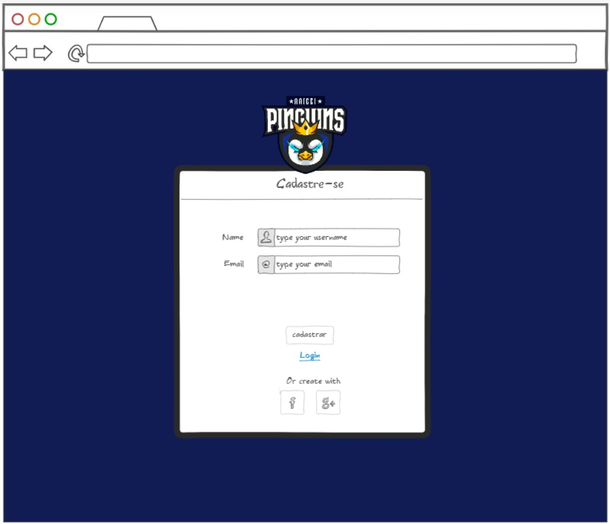
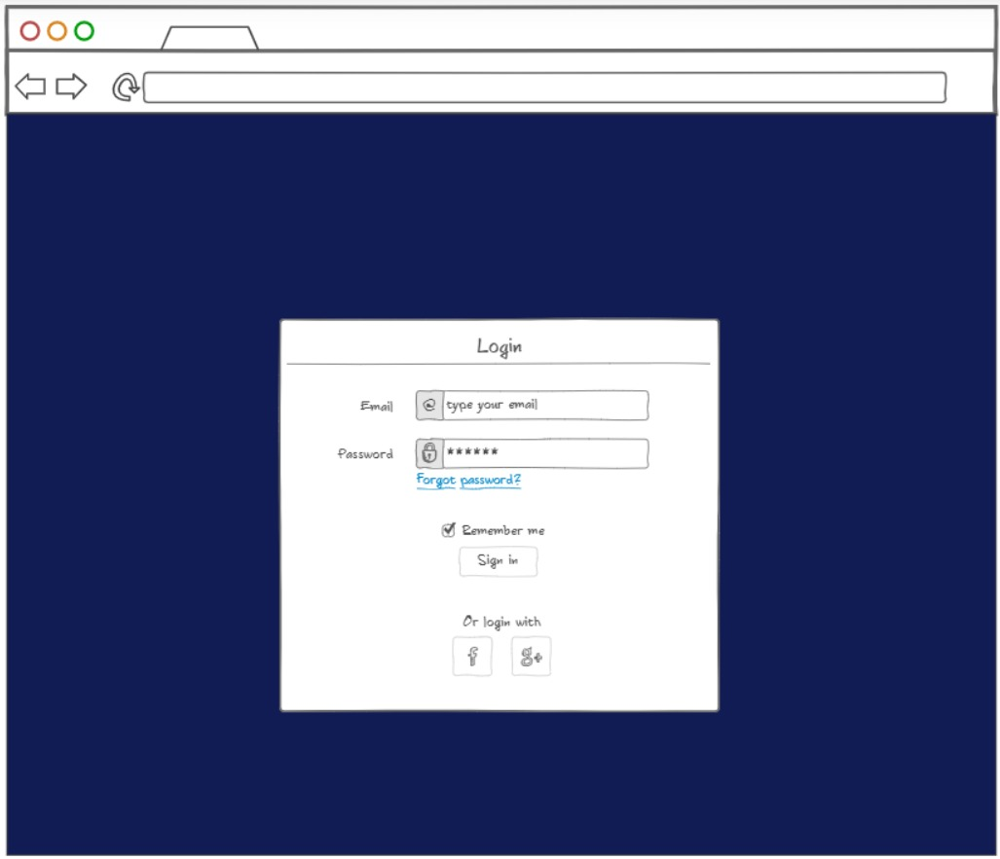
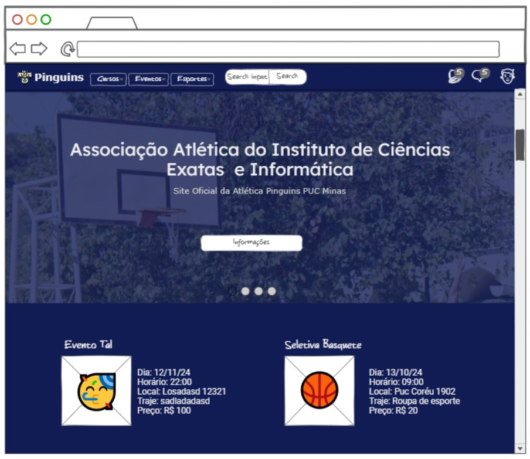
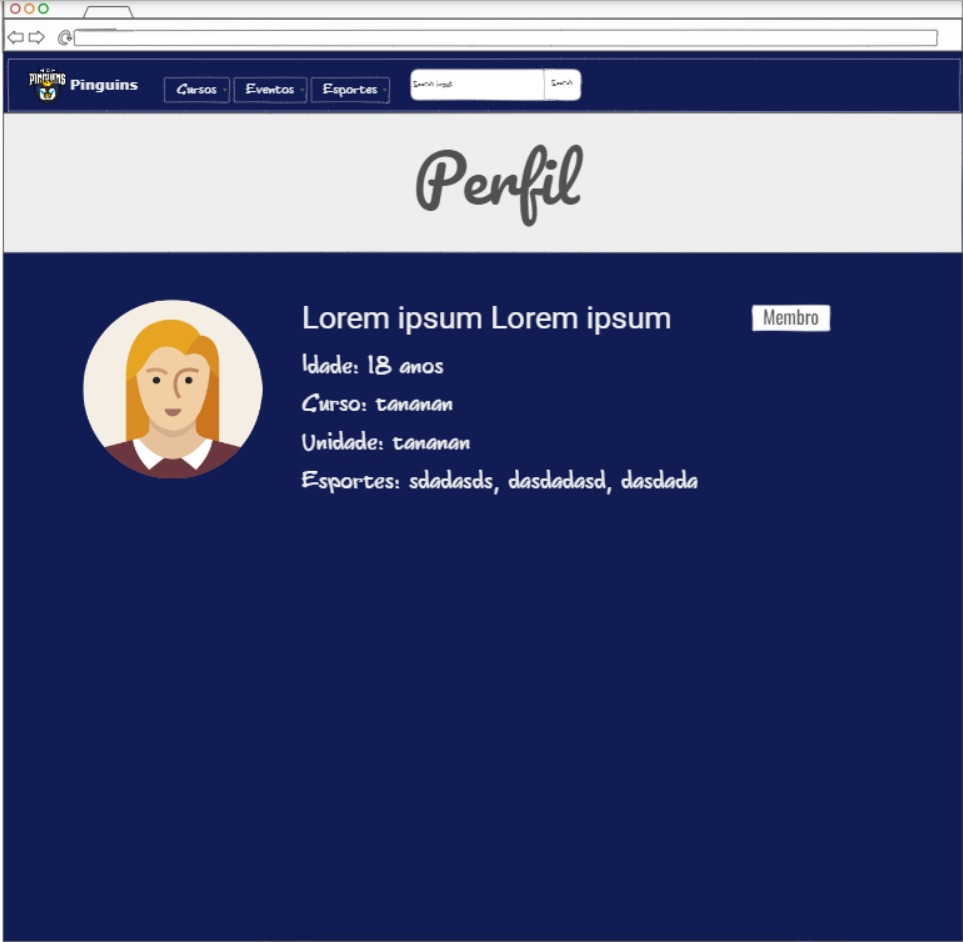
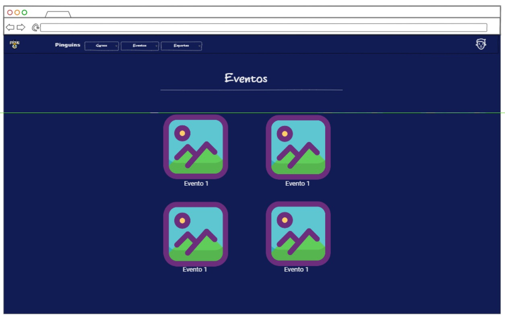
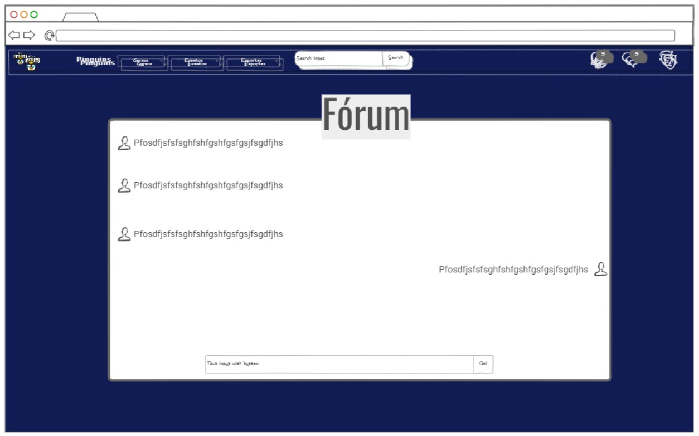

# Portal Atlética

Diante da atual situação enfrentada pela nossa Atlética (Pinguins), compreendemos a importância de possuir uma plataforma digital própria. Para atender a essa necessidade, tomamos a iniciativa de desenvolver uma aplicação web exclusiva, projetada para suprir todas as demandas dos Pinguins de maneira eficaz e integrada. Este passo visa fortalecer nossa presença online, facilitando a comunicação, organização de eventos e acesso a informações relevantes para todos os membros da atlética. Estamos comprometidos em proporcionar uma experiência digital completa e personalizada para nossa comunidade.

## Alunos integrantes da equipe

* Gustavo Mariano Gomes Teixeira
* Mateus Viana Maschietto
* Paulo Filipe Ferreira
* Pedro Leite Pereira

## Professores responsáveis

* Gustavo Henrique Borges Martins
* Wesley Dias Maciel

# Contexto

## Problema

Como mencionado anteriormente, enfrentamos um desafio significativo devido à ausência de um portal exclusivo para a atlética. Essa lacuna tem impactos diretos nos nossos membros, pois a falta de uma plataforma dedicada limita suas capacidades de comunicação com os usuários.

## Objetivo

Criar um portal exclusivo para atlética onde a mesma possa interagir com os visitantes do site. Nesse sentido, com o objetivo de concluir essa tarefa decidimos colocar na plataforma meios da atlética publicar notícias, eventos, fotos, informações de horários de treino e uma aba de comunicação direta com os visitantes do site.

## Justificativa

Baseado em nossas entrevistas com alguns estudantes da PUC Minas, identificamos que os alunos sentem dificuldade em interagir com a atlética Pinguins, pois a falta de uma plataforma própia descentraliza o meio de comunicação entre eles e sua comunidade. Nesse sentido, a falta de um site próprio acaba dificultando o afastamento dos alunos da atlética pela dificuldade de se comunicar com ela.

## Público-alvo

Nosso portal visa atender os alunos da PUC Minas que fazem parte do ICEI (Instituto de Ciências Exatas e Informática), membros ou não membros da atlética Pinguins. Pelo fato de nosso público alvo estar fazendo graduação em uma faculdade particular, eles costumam estar na faixa etária de 19 à 25 anos e  costumam ter uma renda de uma família de classe média para cima.

# Especificações do projeto

## História de usuário
Baseado na análise das personas foram encontradas as seguintes histórias de usuário:

| Eu como `Persona` | Quero/Preciso de `Funcionalidade` | Para `Motivo/Valor` |
| --- | --- | --- |
| Membro da Diretoria | Publicar um evento | Divulgar informação aos visitantes |
| Membro da Diretoria | Remover um evento | Caso o evento seja desmarcado |
| Membro da Diretoria | Atualizar um evento | Caso ocorra mudanças no evento |
| Membro da Diretoria | Adicionar horário de treino | Divulgar informação aos visitantes |
| Membro da Diretoria | Remover horário de treino | Uma equipe pode acabar |
| Membro da Diretoria | Atualizar horário de treino | O horário pode mudar |
| Membro da Diretoria | Publicar fotos dos eventos | Manter os site ativo para visitantes |
| Membro da Diretoria | Uma área para comunicar com os visitantes | Manter interação com os visitantes |
| Membro da Atlética | Visualizar os eventos da atlética | Participar |
| Membro da Atlética | Visualizar os horários de treino | Participar |
| Membro da Atlética | Visualizar as fotos dos eventos | Ver fotos minhas, caso eu tenha participado |
| Aluno da PUC | Visualizar os eventos da atlética | Participar |
| Aluno da PUC | Visualizar os horários de treino | Participar |
| Aluno da PUC | Visualizar as fotos dos eventos | Ver fotos minhas, caso eu tenha participado |
| Aluno da PUC | Uma área para comunicar com a atlética | Caso queira tirar dúvida ou comentar algo |

## Requisitos
As tabelas abaixo mostram os requisitos funcionais e os requisitos não funcionais do projeto.

### Requisitos Funcionais
> [!NOTE]  
> A prioridade está classificada de 1 à 4, sendo 1 a mais alta e 4 a mais baixa.

| Descrição do requisito | Prioridade |
| --- | --- |
| Criar uma sessão de cadastro | ALTA |
| Permitir que qualquer usuário remova sua conta | ALTA |
| Permitir que qualquer usuário atualize sua conta | ALTA |
| Criar uma pagina de perfil | ALTA |
| Permitir para qualquer usuário veja as notícias/eventos | ALTA |
| Permitir que a diretoria publique um evento/notícia | ALTA |
| Permitir que a diretoria remova um evento/notícia | ALTA |
| Permitir que a diretoria atualize um evento/notícia | ALTA |
| Permitir para qualquer usuário veja as horário de treino | ALTA |
| Permitir que a diretoria publique um horário de treino | ALTA |
| Permitir que a diretoria remova um horário de treino | ALTA |
| Permitir que a diretoria atualize um horário de treino | ALTA |
| Criar uma sessão de comunicação da atlética e os visitantes | MÉDIA |
| Permitir para qualquer usuário veja as fotos publicadas | BAIXA |
| Permitir que a diretoria publique fotos | BAIXA |

### Requisitos Não-Funcionais

| Descrição do requisito | Prioridade |
| --- | --- |
| O sistema deve ser intuitivo e de fácil compreensão | ALTA |
| O sistema deve fazer autentificação do usuário | ALTA |
| O sistema deve garantir que os usuários tenham permissões apropriadas aos recursos | ALTA |
| O sistema deve ser responsivo e rodar em dispositivos móveis | MÉDIA |
| O sistema deve ser de fácil manutenção | BAIXA |

# Projeto de Interface

## Wireframes das telas
> [!NOTE]
> Link para o pdf com os protótipos: [protótipo](docs_readme/ninja_prototype.pdf)

> A imagem acima é o protótipo da página de registro.

 

> A imagem acima é o protótipo da página de login.

 

> A imagem acima é o protótipo da página de home.

 

> A imagem acima é o protótipo da página de perfil.

 

> A imagem acima é o protótipo da página de eventos.

 

> A imagem acima é o protótipo do fórum de dúvidas.

## Protótipo interativo

# Metodologia

## Organização da equipe e divisão de papeis
Nossa equipe está utilizando da metodologia ágil Scrum para desenvolver esse projeto, assim separamos as funçoes da seguinte maneira:

* Mateus Viana Maschietto - `Scrum Master`
* Gustavo Mariano Gomes Teixeira - `Product Owner`
* Paulo Filipe Ferreira - `Developer`
* Pedro Leite Pereira - `Developer`

## Ferramentas
Relação das ferramentas utilizadas pela equipe:

| Ambiente | Plataforma | Link de acesso |
| --- | --- | --- |
| Design thinking | Miro | https://miro.com/app/board/uXjVKdTd7Eg=/ |
| Repositório de código | GitHub | https://github.com/ICEI-PUC-Minas-PPLCC-TI/ti-1-ppl-cc-m-20241-3-ppgm |
| Protótipo baixa fidelidade | Ninjamock | https://ninjamock.com/s/M1L8GLx |
| Protótipo alta fidelidade | Figma | https://ninjamock.com/s/M1L8GLx |

## Quadro de Controle de tarefas
Com o objetivo de ter uma maneiro de nos organizarmos, decidimos utilizar o quadro de controle de tarefas Kanban, que já tem o modelo pronto e disponível no Github Projects. Nosso ambiente de gestão de tarefas e dividid em 4 sessões:

**BackLog**
> As funcionalidades que foram identificadas pela o PO e a equipe, solicitadas pelo cliente.

**Reeady**
> As funcionalidade que serão implementadas, nessa sprint

Link para o project: [PPGM_project](https://github.com/orgs/ICEI-PUC-Minas-PPLCC-TI/projects/11/views/1)

